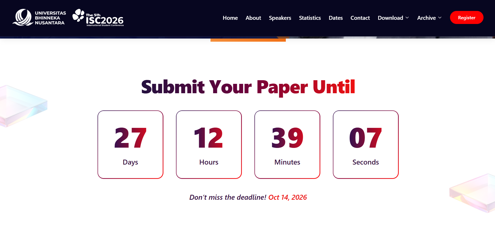
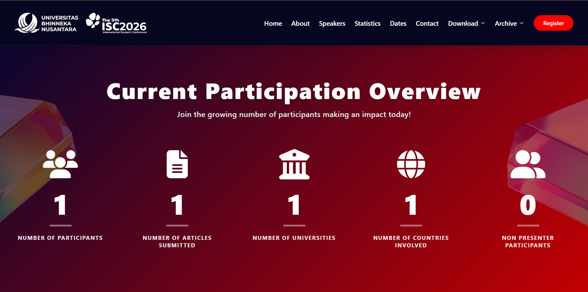
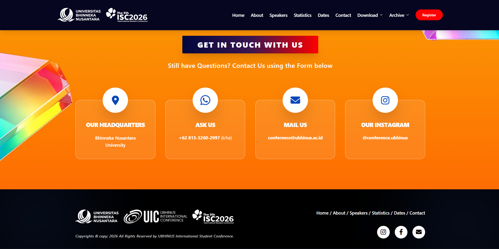
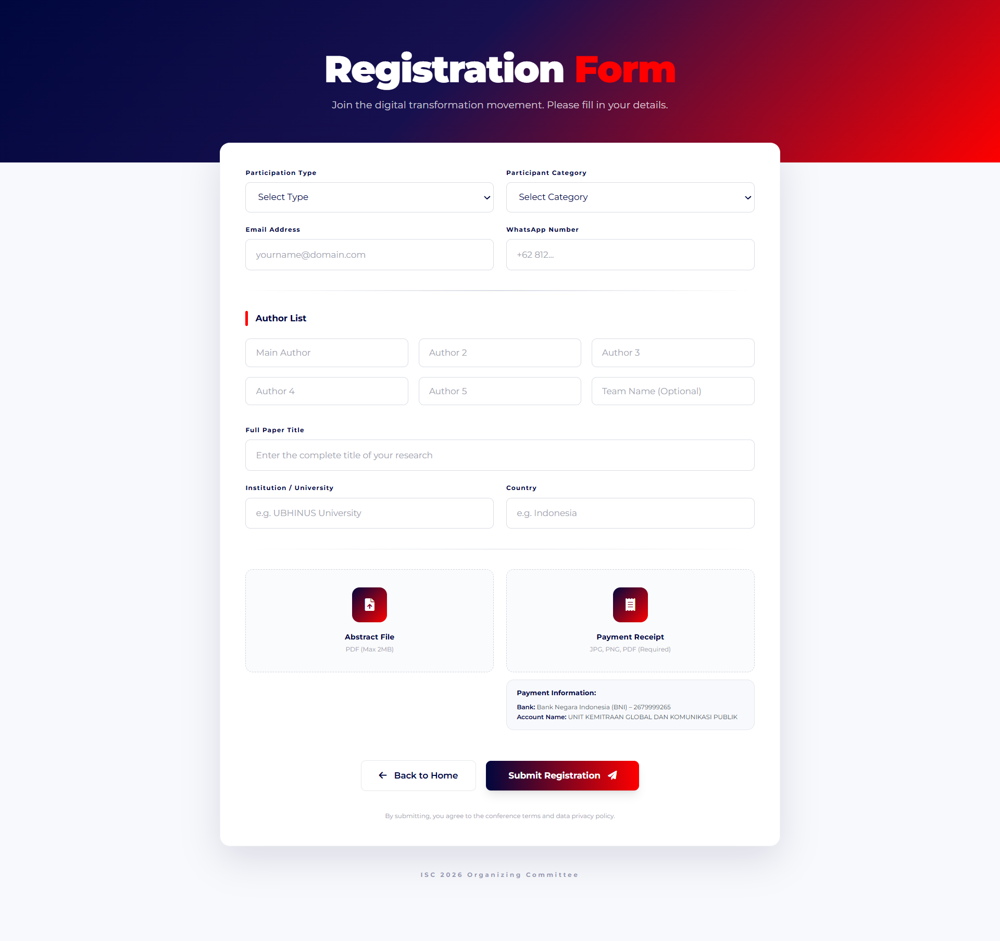
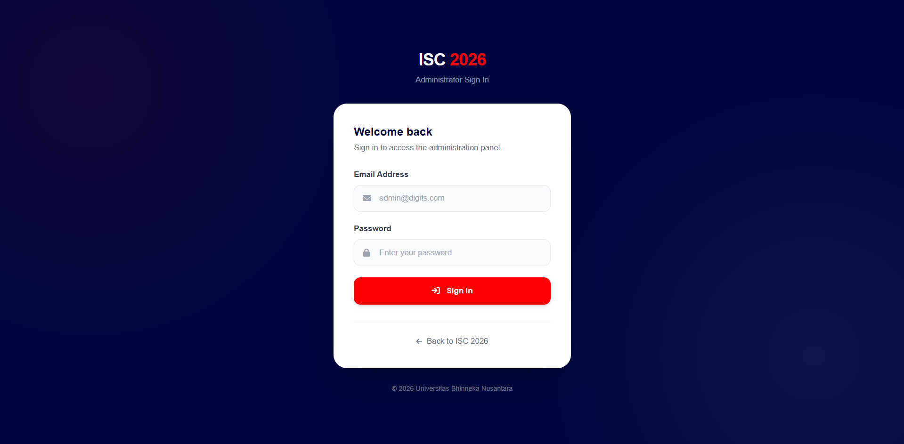
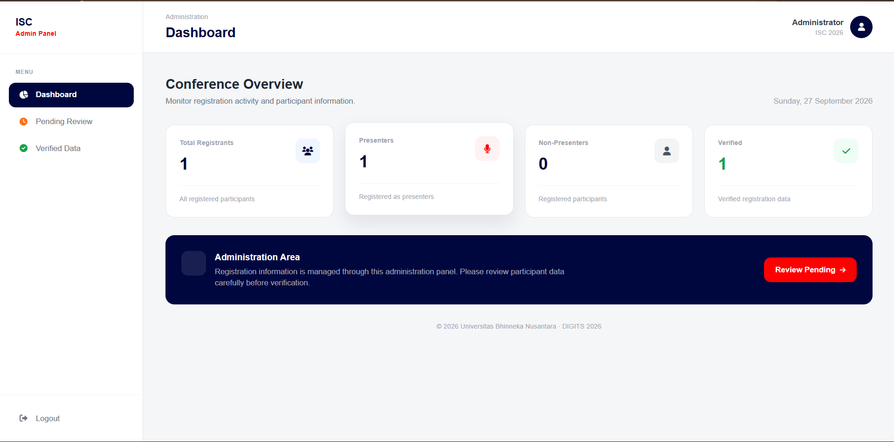
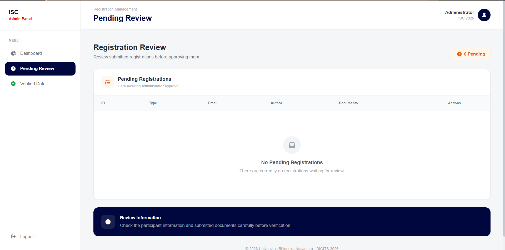
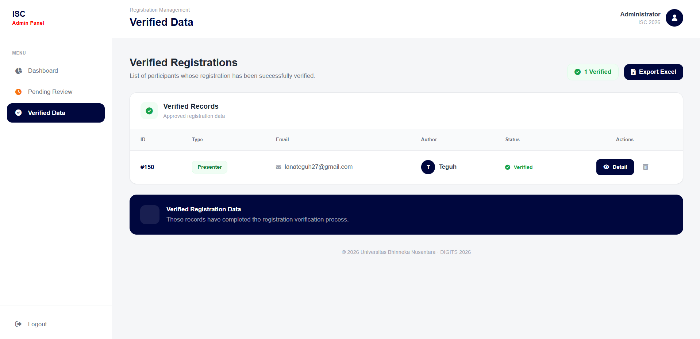

# International Student Conference (ISC)

Website platform untuk mendukung pelaksanaan **International Student Conference (ISC)** yang diselenggarakan oleh **Universitas Bhinneka Nusantara (UBHINUS), Malang, Indonesia**, yang sebelumnya dikenal sebagai STIKI Malang.

Platform ini dikembangkan untuk menyediakan informasi konferensi sekaligus mendukung proses registrasi peserta, pengumpulan abstrak, pembayaran, dan pengelolaan data peserta melalui dashboard administrator.

---

## 📌 Project Overview

**International Student Conference (ISC)** merupakan platform website konferensi akademik yang dirancang untuk membantu proses penyelenggaraan konferensi secara digital.

Melalui website ini, peserta dapat:

* memperoleh informasi mengenai konferensi;
* melihat tema dan cakupan paper;
* melihat informasi keynote speaker;
* melihat jadwal dan important dates;
* melakukan registrasi secara online;
* mengirimkan abstrak penelitian;
* mengunggah bukti pembayaran; dan
* memperoleh informasi terkait proses serta tahapan konferensi.

Di sisi administrator, sistem menyediakan dashboard untuk membantu panitia melakukan pengelolaan dan verifikasi data peserta.

---

## ✨ Features

### 🌐 Public Website

Website utama menyediakan berbagai informasi mengenai konferensi, meliputi:

* Conference Overview
* Conference Theme
* Paper Scope
* Keynote Speakers
* Important Dates
* Co-host Information
* Registration Information
* Payment Information
* Publication Information
* Contact Information
* Responsive interface untuk desktop, tablet, dan mobile

### 📝 Online Registration

Peserta dapat melakukan proses pendaftaran secara online.

Fitur registrasi meliputi:

* Participant Registration
* Participant Type Selection
* Personal Information
* Institution Information
* Abstract Submission
* Payment Receipt Upload
* Data and File Validation
* Registration Confirmation
* Conference Schedule Information

### 📄 Abstract Submission

Peserta dapat mengirimkan abstrak penelitian melalui sistem registrasi.

Dokumen yang dapat dikirimkan meliputi:

* Abstract File
* Payment Receipt

File yang dikirimkan dapat diperiksa oleh administrator melalui sistem administrasi.

### 🔐 Admin Dashboard

Sistem menyediakan dashboard administrator untuk membantu panitia mengelola data peserta.

Fitur utama meliputi:

* Participant Statistics
* Pending Participant Verification
* Verified Participant List
* Participant Detail
* Abstract File Review
* Payment Receipt Review
* Participant Verification
* Participant Data Management
* Excel Data Export
* Administrator Authentication

### 🔔 Notification System

Sistem menyediakan notifikasi interaktif untuk memberikan informasi kepada pengguna mengenai:

* Registration Status
* Registration Confirmation
* Abstract Submission
* Payment Information
* Important Information
* Conference Schedule
* Registration Deadline

---

## 🛠️ Technology Stack

### Frontend

* HTML5
* CSS3
* Tailwind CSS
* JavaScript
* Font Awesome
* SweetAlert2

### Backend

* PHP
* MySQL / MariaDB
* PDO
* PHPMailer

### Development Tools

* Visual Studio Code
* XAMPP / Laragon
* Composer
* Git
* GitHub

---

## 📁 Project Structure

```text
ISC/
│
├── admin/
│   ├── .htaccess
│   ├── actions.php
│   ├── auth.php
│   ├── auth_check.php
│   ├── belum_setuju.php
│   ├── export_excel.php
│   ├── index.php
│   ├── login.php
│   ├── logout.php
│   └── sudah_setuju.php
│
├── img/
│   ├── coverhalaman/
│   ├── icon/
│   ├── keynotespeaker/
│   └── logocohost/
│
├── index.php
├── registration.php
├── process_registration.php
├── composer.json
├── composer.lock
├── .gitignore
└── README.md
```

> **Note:** Direktori `uploads/`, `vendor/`, serta file konfigurasi lokal tidak disertakan dalam repository karena dapat berisi data pengguna, dependency hasil instalasi, atau informasi sensitif.

---

## ⚙️ Requirements

Sebelum menjalankan project, pastikan environment lokal telah memiliki:

* PHP 8.x atau versi yang sesuai dengan project
* MySQL / MariaDB
* Apache
* Composer
* XAMPP atau Laragon
* Web browser modern

---

## 🔧 Installation & Configuration

### 1. Clone Repository

```bash
git clone https://github.com/lanateguh27/isc.git
cd isc
```

### 2. Install Composer Dependencies

Jalankan:

```bash
composer install
```

Dependency project akan di-install ke direktori `vendor/`.

### 3. Create Database

Buat database MySQL / MariaDB untuk project ISC.

Contoh nama database:

```text
isc_database
```

Kemudian import database schema yang digunakan oleh project.

> Database dump tidak disertakan dalam repository apabila mengandung data peserta atau data operasional asli.

### 4. Configure Database

Buat file konfigurasi lokal sesuai environment masing-masing.

Contoh konfigurasi:

```php
<?php

$host = 'localhost';
$db   = 'isc_database';
$user = 'root';
$pass = '';

$pdo = new PDO(
    "mysql:host=$host;dbname=$db;charset=utf8mb4",
    $user,
    $pass
);

$pdo->setAttribute(
    PDO::ATTR_ERRMODE,
    PDO::ERRMODE_EXCEPTION
);
```

**Jangan memasukkan credential database asli ke repository publik.**

### 5. Configure Upload Directory

Pastikan direktori berikut tersedia pada environment lokal:

```text
uploads/
├── abstracts/
└── receipts/
```

Direktori tersebut digunakan untuk menyimpan file yang diunggah melalui sistem.

### 6. Run the Application

Jika menggunakan XAMPP atau Laragon, letakkan project pada directory web server.

Contoh:

```text
htdocs/isc/
```

Kemudian aktifkan:

* Apache
* MySQL

Akses melalui browser:

```text
http://localhost/isc/
```

---

## 🌐 Application Pages

### Public Website

```text
http://localhost/isc/
```

### Registration

```text
http://localhost/isc/registration.php
```

### Administrator

```text
http://localhost/isc/admin/
```

> URL dapat berbeda tergantung konfigurasi web server dan nama folder project pada environment lokal.

---

## 🔐 Security Considerations

Repository ini tidak menyertakan beberapa file atau direktori yang berpotensi mengandung informasi sensitif atau data operasional.

Contohnya:

```text
config.php
uploads/
vendor/
.env
```

File konfigurasi database harus dibuat secara lokal dan tidak boleh berisi credential yang dipublikasikan ke repository.

Direktori `uploads/` juga tidak disertakan karena dapat berisi dokumen peserta seperti abstract dan payment receipt.

---

## 📸 Screenshots

Screenshots aplikasi dapat ditambahkan pada bagian ini untuk memberikan gambaran mengenai interface dan fitur utama sistem.

Contoh:

### Homepage







### Registration Page



### Admin Dashboard




### Participant Management




---

## 👨‍💻 Development

Project ini dikembangkan sebagai platform web untuk mendukung digitalisasi proses registrasi dan administrasi **International Student Conference (ISC)**.

Pengembangan mencakup sisi frontend, backend, database integration, file upload handling, administrator authentication, participant management, dan data export.

---

## 📄 License

This project is intended for educational and portfolio purposes.

Copyright © International Student Conference (ISC).
